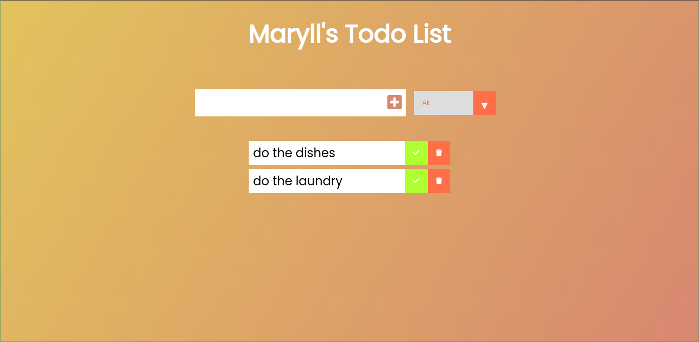

# Todo-JS
A simple Todo app implemented using Vanilla JavaScript by following [this](https://www.youtube.com/watch?v=Ttf3CEsEwMQ) tutorial by Dev Ed. 
Deployed to github pages [here](https://maryll-castelino.github.io/Todo-JS/).

## screenshot:

